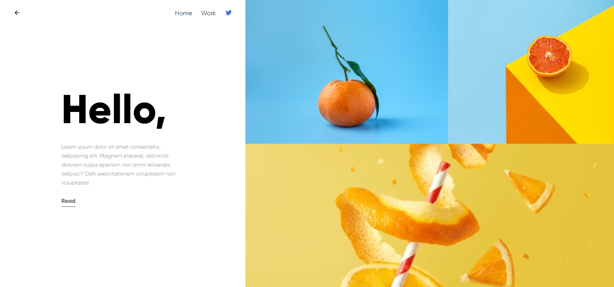

Citrus Studio Landing Page.png# Citrus Studio Landing Page

A responsive and visually minimal landing page inspired by modern editorial and product showcase websites.

Built using pure HTML and CSS, the project focuses on clean layout structure, typography hierarchy, split-screen composition, responsive behavior, and image-based storytelling.

---
## 📸 Preview



---

## ✨ Features

- Responsive split-screen layout
- Editorial-inspired UI composition
- Image grid hero section
- Custom typography styling
- Navigation bar with icons
- Mobile responsive design
- Pure HTML and CSS implementation

---

## 🛠 Tech Stack

- HTML5
- CSS3
- Flexbox
- Media Queries
- Remix Icons

---


## 🚀 Live Demo

https://srisahithinagulavancha.github.io/Citrus-Studio-Landing-Page/

---

## 📁 Folder Structure

```bash
├── index.html
├── style.css
├── images/
└── README.md
